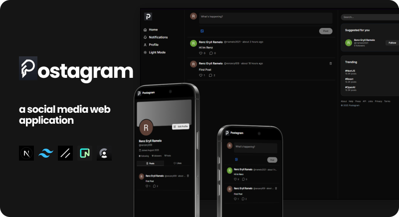

<p align="center">
  
</p>

##

<p align="center">
  
  
  
  
  
  
</p>

<h1 align="center">📱 Postagram</h1>

<p align="center">
  Postagram is a social media web application built with <b>Next.js</b> and styled with <b>Tailwind CSS</b> and <b>Shadcn UI</b>.  
  It provides secure user authentication, posting, and interaction features, with a backend powered by <b>Neon PostgreSQL</b> and <b>Prisma ORM</b>.
</p>

---

## ✨ Features

- 🔒 Authentication with **Clerk**, with users synced to Postgres on first sign-in
- 📝 Create posts with text and images, delete your own posts
- ❤️ Like posts with optimistic UI updates (rolled back if the server call fails)
- 💬 Comment threads on every post
- 👥 Follow / unfollow users, with "Suggested for you" recommendations
- 🔔 Notifications for likes, comments and follows, with an unread badge
- 👤 Profile pages with editable bio, location, website and avatar, plus Posts / Likes tabs
- 🌗 Light / dark mode and a responsive layout (desktop sidebars, mobile bottom nav)

---

## 🏗️ Architecture

- **Next.js 15 App Router**: pages are React Server Components that fetch data directly; interactive pieces (`PostCard`, `ProfileClient`, …) are client components.
- **Server Actions** (`src/lib/actions/*`) handle every mutation. Each one re-checks the signed-in user on the server, so authorization never depends on the client.
- **Prisma + PostgreSQL** data model: `User`, `Post`, `Comment`, `Like`, `Follows`, `Notification`. Unique constraints stop duplicate likes and follows; like + notification writes run in a single transaction.
- **Cache revalidation** with `revalidatePath` keeps the feed and profile pages fresh after mutations.

```
src/
├── app/                 # routes: feed, /profile/[username], /notifications, /api/upload
├── components/          # UI components (shadcn/ui primitives in components/ui)
└── lib/
    ├── actions/         # server actions (posts, users, profiles, notifications)
    ├── post.ts          # shared Prisma include + validation limits
    └── prisma.ts        # Prisma client singleton
```

---

## 🌐 Demo

🔗 **Live Demo**: https://postagram-app.vercel.app

---

## ⚡ Quick Start

### 1️⃣ Clone the repository

```bash
git clone https://github.com/Renz-Eryll/Postagram.git
cd Postagram
```

### 2️⃣ Environment setup

Copy `.env.example` to `.env` and fill in your values:

```env
DATABASE_URL=your_database_url_here
NEXT_PUBLIC_CLERK_PUBLISHABLE_KEY=your_clerk_publishable_key_here
CLERK_SECRET_KEY=your_clerk_secret_key_here
```

### 3️⃣ Install dependencies and set up the database

```bash
npm install
npx prisma db push
```

### 4️⃣ Start the development server

```bash
npm run dev
```

Open **http://localhost:3000** in your browser.

### Scripts

| Command             | Description                 |
| ------------------- | --------------------------- |
| `npm run dev`       | Start the dev server        |
| `npm run build`     | Production build            |
| `npm run lint`      | Run ESLint                  |
| `npm run typecheck` | Run the TypeScript compiler |

---

## 📧 Contact

- **Name**: Renz Eryll Ramelo
- **LinkedIn**: [www.linkedin.com/in/renz-eryll-ramelo](https://www.linkedin.com/in/renz-eryll-ramelo)
- **GitHub**: [https://github.com/Renz-Eryll](https://github.com/Renz-Eryll)
